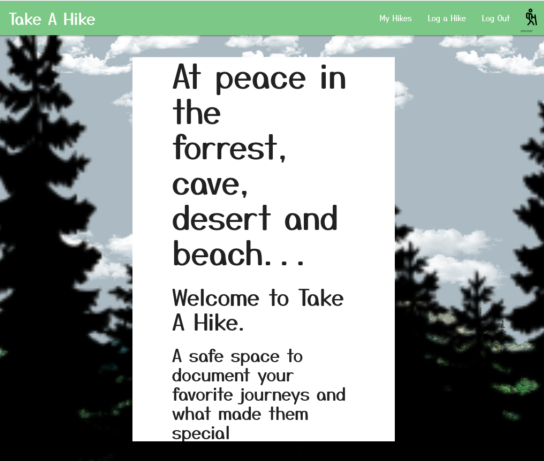
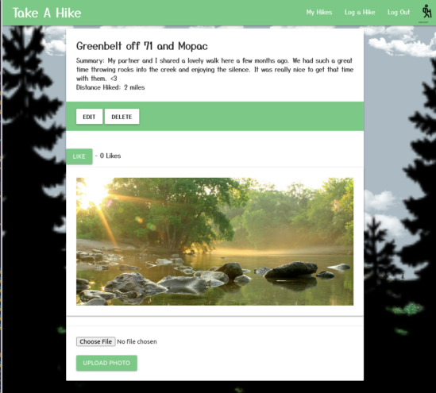
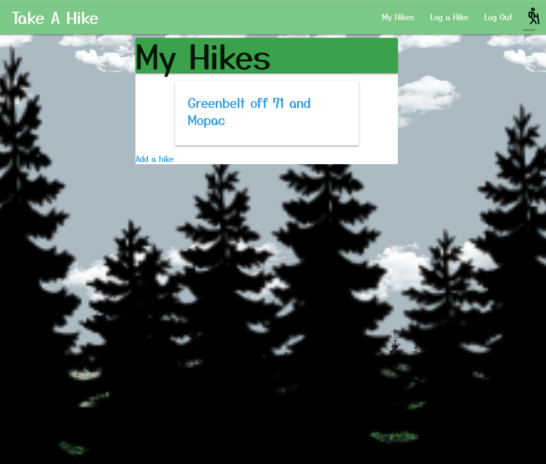

# Take a Hike
## A safe space to document your favorite journeys and what made them special

[Stroll](https://takeahikeapp.herokuapp.com/)

Enjoy your stroll through Take a Hike. Log your journeys and share photos of your hike!

## Screenshots

## Trello Planning

[Trello](https://trello.com/b/G8qhmmrh/take-a-hike)

Take a look at my Trello board for Take a Hike wireframes and workflow!

## Icebox Features

1. Add user index to see other user's hikes.
2. Socket chat for hiker's to plan meetups.

## Challenge and Takeaways

Being my first app that I have built in Python and Django, things could have gone much worse! There are a lot of syntax differences that were tough to wrap my head around, but I'm excited to build profeciency in Python so that I can take a deeper dive into fun ideas for functionality.

## Attributions and Special Thanks

-Massive thanks to my GA SEI cohort instructors, TA's and fellows for all the assists and laughs.

-Styling provided by Materialize

-Hiker by Ayub Irawan from the Noun Project

- Animation by Captain Anonymous from CodePen